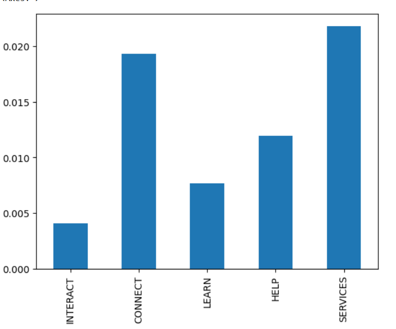
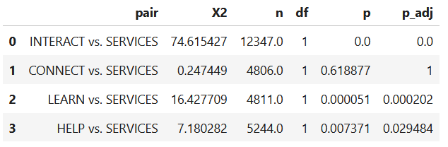

# AB-testing-analysis

Data Science Exercise: Analyzing results from an AB-Test for different button labels to improve web traffic

## Background

Case Study: The Library of Montana State University has a website that students use to find books and articles. Below the library picture, there is a search bar and three big items: “Find”, “Request” and “Interact”. However, the Website Analytics show that the “Interact” button has, ironically, almost no interactions. Throughout a two week testing period alternative button labels "Connect", "Learn", "Help" and "Service" were AB tested. The click-through rates (CTR) for the different buttons was used a a measure of performance.

## Usage

The raw data are available in the data directory. See the Jupyter Notebook for detailed steps how CTR was calculated and significance test was performed.

## Results

There was a significant difference between CTRs of the tested button labels: X2(4, n = 21016.0) = 96.743, p < 0.001

"Services" had the highest CTR followed by "Connect". Pairwise comparison showed that there was no significant performance difference between these two, while all other labels had a significantly lower CTR than "Services". Additional metrics such as drop-off rate could be used to determine the better version between these two. However, this was not in the scope of this project.

